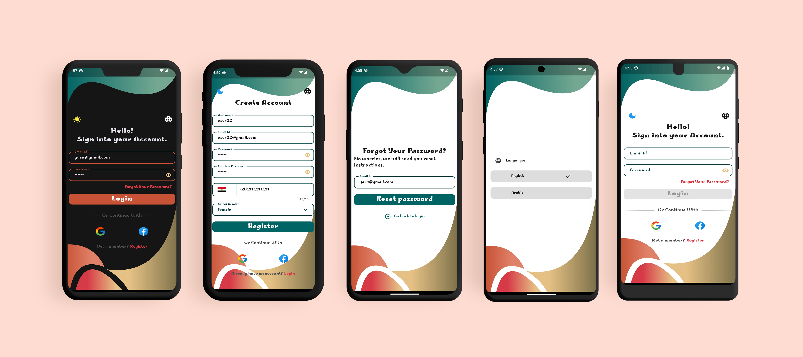
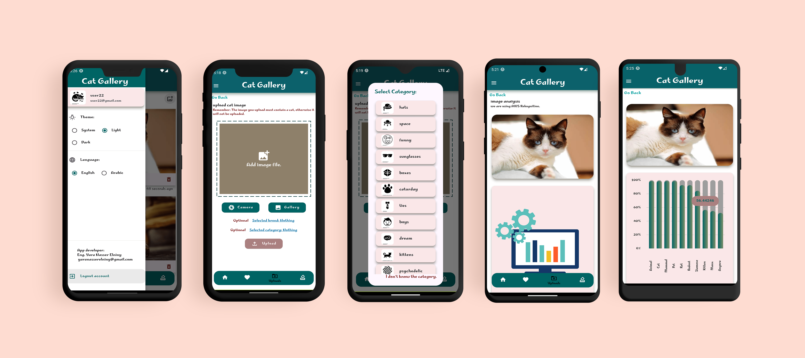
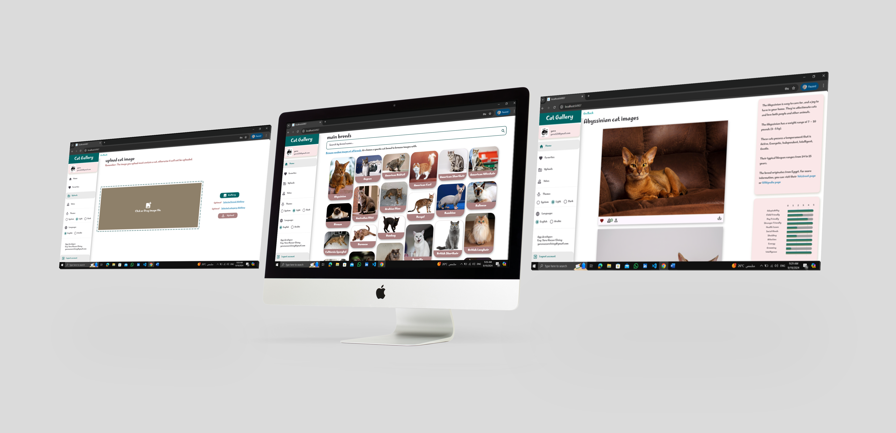
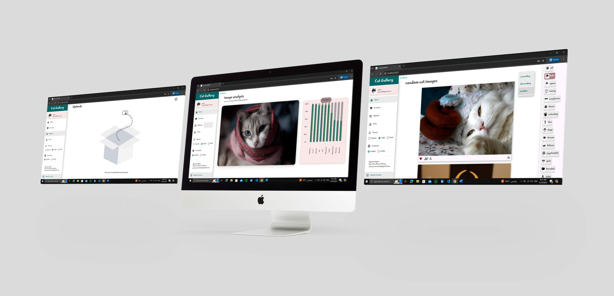

# CatGallery

A powerful app built with Flutter for browsing random cat images, or with a specific breed name.
using free api from [TheCatApi - cats as a service.](https://thecatapi.com/)

This application is developed for educational purposes.

## 📱 Getting Started
This project is responsive and adaptive to all devices with few limits on the web.
using clean architecture with **MVVM pattern**, and **Bloc - Cubit** for state management.

## 📸 Screens

  

  

  

  

  

 

 

## ✨ Features:
- **Firebase Auth:** login | register via user name and password, forgot password, google sign in, facebook sign in.
- **FireStore database:** store and retrieving users data using express queries.
- **Client-Side Validation** on login, register, forgot password pages.
- Real-time Updates via **REST APIs.** 
- Home page data caching for offline use.
- Infinite scroll, **pagination**.
- Animations (size Animation, Lottie, Fading, etc.).
- Custom Light/Dark Mode.
- Modern UI with New Material Widgets.
- Support both **Arabic and English** locales.
- Image analysis model to recognize objects in a specicfic image (comes with TheCatApi itself).
- **Search** functionality with both locales.
- **Upload** images to server (not working for web).
- **Download** images.
- **Share** images to other apps (mobile & tablet only)
- Drag and drop images (web based).
- Like | Unlike images.
- Vote on images.
- **And much more...** 

## 🎉Upcoming features
- Daily cat facts notifications using **FCM.**
- Upload images for web : we will try to overcome the flutter web limitations to add this feature.

## 📐 How to set-up this project on local machine?
- Fork this project

- Then clone the forked project by

  `git clone github.com/<username>/cat_gallery`

- once cloned, open this project in your favorite code-editor and run: `flutter pub get`
- Wohoo!! now you can now run this project on your emulator or physical device just do `flutter run`

## 📦 App Apk:
[Click here to download the global apk](https://drive.google.com/drive/u/0/folders/1Sww1Jf620nose8hiXKVTojgVU9kr5Paa)

## 💬 Feedback and Suggestions:

For any feedback or suggestions, feel free to contact me via email:  
📧 [yaranaserelniny30999@gmail.com](mailto:yaranaserelniny30999@gmail.com)

## Enjoy! 💕
If you like this project, don't forget to give it a star ⭐ and fork this project.